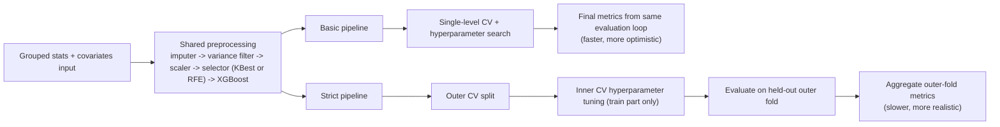

# GeneActiv / preDLB Project Update Report

Prepared: 2026-05-06  
Project path: `E:\geneactiv-processing-data`

This report updates the previous summary (`phd_supervisor_experiment_report_2026-04-23.md`) with the newest experiments, including strict nested-CV runs and RFE comparisons.

## 1) Executive Summary

1. The strict pipeline is now completed for `dataset-clinical` with covariates (`k-best` selector).
2. In the main endpoint (`preDLB vs HC`), strict performance is lower than simple CV (expected), but still above chance:
   - strict tuned: `BACC 0.6420`, `MCC 0.2832`, `F1 0.6308`, `ROC-AUC 0.7102`
3. In the non-strict pipeline with covariates, RFE did **not** beat the previous `k-best` result on core metrics (`BACC`, `MCC`, `ROC-AUC`).
4. `F1 = 0.8` was not reached (and appears not reachable from current probability distributions for this endpoint).
5. A repeated pattern is visible: second visits (`pre-LBD2`) are usually classified more accurately than first visits (`pre-LBD`), but sample size is small and not yet statistically significant.

## 2) New Experiments Included

### 2.1 Non-strict with covariates (reference best)

- Run: `media/classification/grouped-statistics-with-covariates/dataset-clinical/all/20260422_215810`
- Scenario: `scenario-preDLB_vs_HC`
- Tuned metrics: `BACC 0.7535`, `MCC 0.5241`, `F1 0.7103`, `ROC-AUC 0.8194`, `PR-AUC 0.8182`

### 2.2 Non-strict with covariates + RFE

- Run: `media/classification/grouped-statistics-with-covariates/dataset-clinical-rfe/all/20260504_103411`
- Scenario: `scenario-preDLB_vs_HC`
- Tuned metrics: `BACC 0.7150`, `MCC 0.4326`, `F1 0.7111`, `ROC-AUC 0.7590`, `PR-AUC 0.7024`

Interpretation:

- RFE preserved F1 (very similar) but reduced ranking/discrimination quality (`AUC`, `MCC`, `BACC`) versus `k-best`.
- Therefore RFE is not the preferred selector for this endpoint in the simple pipeline.

### 2.3 Strict nested-CV with covariates (publication-focused)

- Run: `media/classification/grouped-statistics-strict-with-covariates/dataset-clinical/20260504_175456`
- Sheet: `nested_tuned_metrics`

| Scenario | ROC-AUC | PR-AUC | BACC | MCC | SEN | SPE | F1 |
|---|---:|---:|---:|---:|---:|---:|---:|
| preDLB vs HC | 0.7102 | 0.6586 | 0.6420 | 0.2832 | 0.6949 | 0.5890 | 0.6308 |
| preDLB+MCI-AD vs HC | 0.6868 | 0.7451 | 0.6261 | 0.2675 | 0.7865 | 0.4658 | 0.7071 |
| MCI-AD vs HC | 0.4817 | 0.2925 | 0.4934 | -0.0140 | 0.2333 | 0.7534 | 0.2545 |

Interpretation:

- Main endpoint remains the most viable (`preDLB vs HC`).
- `MCI-AD vs HC` remains near chance and should not be treated as a reliable classifier result.

### 2.4 Strict + covariates + RFE pilot

- Run: `media/classification/grouped-statistics-strict-with-covariates/dataset-clinical-rfe/20260503_103736`
- `scenario-preDLB_vs_HC` tuned: `BACC 0.6612`, `MCC 0.3237`, `F1 0.6207`
- This run was a pilot/partial process and is not the main strict reference.

## 3) Is It Good Enough for Publication?

Short answer: **good for thesis proof-of-concept and exploratory publication, but not yet strong enough for definitive clinical claims**.

Why:

1. Strict metrics for the main endpoint are moderate (`BACC 0.6420`, `MCC 0.2832`) rather than high.
2. Performance is unstable across scenarios, with one scenario near chance.
3. Best simple results are clearly more optimistic than strict results (expected CV optimism gap).
4. Current evidence supports signal presence, but not yet robust clinical-grade discrimination.

What is publication-acceptable now:

- A transparent exploratory paper/thesis chapter focused on:
  - pipeline development,
  - strict vs non-strict gap,
  - covariate contribution,
  - endpoint-specific performance behavior.

What is not yet supported:

- strong diagnostic performance claims for routine clinical deployment.

## 4) Recommended Next Steps (Priority Order)

1. Keep `preDLB vs HC` as primary endpoint and make other scenarios secondary/exploratory.
2. Run strict nested-CV on `dataset-clinical-acc` with covariates for robustness:
   - action: `classification-grouped-stats-strict-covariates-clinical-acc`
3. Add uncertainty intervals (bootstrap confidence intervals) for `BACC`, `MCC`, `AUC`, `F1`.
4. Verify repeated-visit handling explicitly (group by canonical patient where needed) to avoid hidden optimism.
5. Fix a primary evaluation target for the thesis (recommended: `MCC` + `BACC`), and treat thresholded `F1` as secondary.
6. Keep RFE as sensitivity analysis appendix, not as primary selector for the current endpoint.
7. In strict `k-best`, consider removing `k='all'` from search space (or down-weighting it), because final strict models can otherwise select all features and lose interpretability/pruning benefits.

## 5) Final Assessment for Current Cycle

The project has achieved a meaningful proof-of-concept signal, especially for `preDLB vs HC`, and the strict pipeline now provides a defensible evaluation framework.

At this stage, the results are best framed as:

- promising for research,
- methodologically improving,
- not yet definitive for high-confidence clinical performance claims.

## 6) Visit-Level Pattern: pre-LBD vs pre-LBD2

Question addressed:

- Are second visits (`pre-LBD2`) classified better than first visits (`pre-LBD`) in `scenario-preDLB_vs_HC`?

Method:

- Compared tuned predictions in `subject_predictions.xlsx` for true preDLB subjects only.
- Group sizes in this scenario were stable across runs:
  - `pre-LBD`: `n=37`
  - `pre-LBD2`: `n=12`

Results (tuned predictions):

| Run | pre-LBD accuracy | pre-LBD2 accuracy |
|---|---:|---:|
| strict + covariates (k-best), `20260504_175456` | 64.9% (24/37) | 83.3% (10/12) |
| strict + covariates (RFE pilot), `20260503_103736` | 56.8% (21/37) | 83.3% (10/12) |
| simple + covariates (k-best), `20260422_215810` | 70.3% (26/37) | 75.0% (9/12) |
| simple + covariates (RFE), `20260504_103411` | 81.1% (30/37) | 91.7% (11/12) |

Statistical caveat:

- Fisher exact tests for the `pre-LBD` vs `pre-LBD2` error-rate difference were not significant in these runs (`p > 0.16` in all comparisons).
- Therefore, this should be reported as a **consistent tendency**, not a confirmed statistical effect at this stage.

Interpretation:

- The direction remains biologically plausible and clinically interesting (later visit possibly easier to classify due to stronger disease signal).
- This signal should be treated as a pre-registered follow-up hypothesis and tested on larger samples / external validation.

## 7) Additional Patterns (Feature Importance + PCA)

### 7.1 Feature-importance consistency across runs

Across the best-performing families (simple `k-best + covariates` and strict `k-best + covariates`), two diary covariates repeatedly remain high-impact:

- `rest_quality_mean`
- `alcohol_time_mean`

Additional diary timing variability features appear in SHAP top lists in stricter / RFE settings:

- `alcohol_time_std`
- `caffeine_time_std`
- `sleep_quality_mean`

Interpretation:

- Diary-derived behavioral context is not a one-off artifact; it repeatedly contributes in different training setups.
- The strongest repeated covariates remain quality/rest and alcohol timing-related features.

### 7.2 Feature-set stability

Top-20 model-importance overlap between simple and strict `k-best + covariates` for `preDLB vs HC` was:

- `7 / 20` shared features

Shared examples:

- `rest_quality_mean`
- `alcohol_time_mean`
- `diary.Wake bouts (Slope)`
- `diary.Sleep fragmentation (Slope)`
- `actigraphy.Awakening > 5 minutes (Min)`

Interpretation:

- The signal is partially stable, but not fully stable, which is expected with limited sample size and many correlated features.

### 7.3 Selector behavior pattern

Observed in the latest runs:

- Simple `k-best + covariates` selected `k=20` in top search results.
- Strict `k-best + covariates` final-model search often ranked `k='all'` best.

Interpretation:

- Under strict nested settings, the model may prefer larger feature sets.
- This can reduce interpretability and may reflect weak penalty against complexity in current tuning space.

### 7.4 PCA findings (quantitative)

From `pca_projection.xlsx` (`dataset-clinical`, all diagnoses):

- PC1 explained variance: `11.52%`
- PC2 explained variance: `9.42%`
- PC1+PC2 total: `20.94%`

Clustering/separation signal in 2D PCA was weak:

- 4-class silhouette on `(PC1, PC2)`: `-0.0681`
- HC vs preDLB using only `(PC1, PC2)` with LOO logistic:
  - `BACC 0.5139`
  - `AUC 0.5746`

Interpretation:

- The 2D PCA visualization is useful for sanity checks, but it should not be interpreted as evidence of strong class separability.
- Most discriminative information likely lives in higher dimensions and non-linear interactions, not in PC1/PC2 alone.

### 7.5 Cohort-structure pattern in PCA

Subject-prefix composition in PCA input:

- `pre-LBD`: `131`
- `COBEN`: `81`
- `HC`: `29`

Among top 30 subjects by `|PC1|` magnitude:

- `pre-LBD`: `19`
- `COBEN`: `9`
- `HC`: `2`

Interpretation:

- Prefix/cohort structure is strong and can influence global geometry.
- This supports continued caution about cohort effects and visit-structure effects in interpretation.

## 8) Methodological Note: KBest vs RFE and Strict vs Basic Pipeline

### 8.1 Feature selection: theory

`SelectKBest` (`k-best`):

- Scores each feature independently (in our case ANOVA/F-statistic style ranking).
- Keeps the top `k` ranked features.
- Very fast and stable, but it does not model feature interactions during selection.

`RFE` (Recursive Feature Elimination):

- Trains a model, ranks features by model importance, removes the weakest, and repeats.
- Selection is model-aware and can better reflect interaction structure.
- Much slower and can be less stable on smaller/noisier datasets.

### 8.2 How this is implemented in our project

Both selector modes are inserted into the same preprocessing/model stack:

1. imputation (`SimpleImputer`)
2. variance filtering
3. scaling
4. feature selector (`k-best` or `RFE`)
5. XGBoost classifier

`k-best` mode tunes `k` (including candidate values like `20`, `40`, ... , `all`).

`RFE` mode tunes:

- number of retained features (`n_features_to_select`)
- elimination step size (`step`)

### 8.3 Basic vs strict pipeline (key difference)

Basic pipeline (`classification-grouped-stats-*`):

- Hyperparameter search and evaluation happen in a single-level workflow.
- Faster, good for exploration and iteration.
- Typically optimistic (higher apparent metrics) because model selection and final evaluation are less strictly separated.

Strict pipeline (`classification-grouped-stats-strict-*`):

- Uses nested cross-validation (inner tuning, outer evaluation).
- Slower but methodologically stronger for publication.
- Gives more realistic out-of-sample estimates (usually lower than basic pipeline).

Visual schema:

### 8.4 Practical conclusion from our runs

- For `preDLB vs HC`, `k-best + covariates` remained the primary choice.
- RFE did not improve the core discrimination metrics enough to replace `k-best` as the main selector.
- Strict results should be treated as the primary publication-grade estimate, while basic results are supportive/exploratory.
